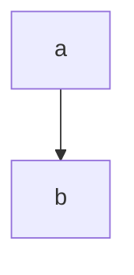

# 図の種類の見本の設計

テストの素材として書き起こした設計書の見本である。実在の設計の記録ではない。

## 1. 構成


```mermaid
flowchart LR
    a["入口"] --> b["保存"]
```


```mermaid
graph TD
    a --> b
```

## 2. データ


```mermaid
erDiagram
    REVIEW ||--o{ FINDING : has
```

### 2.1 状態


```mermaid
stateDiagram-v2
    [*] --> open
```

#### 2.1.1 補足

```text
## コードの中の見出しに見える行
```
